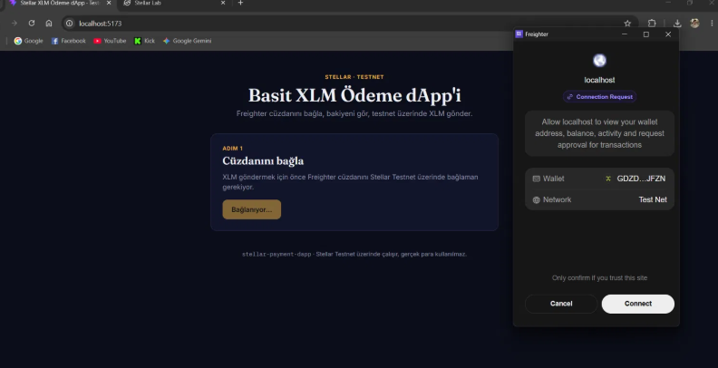
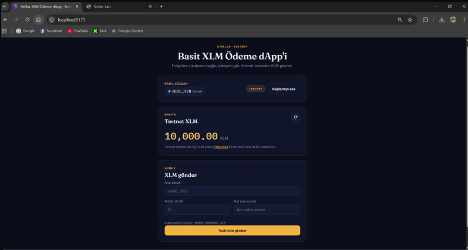
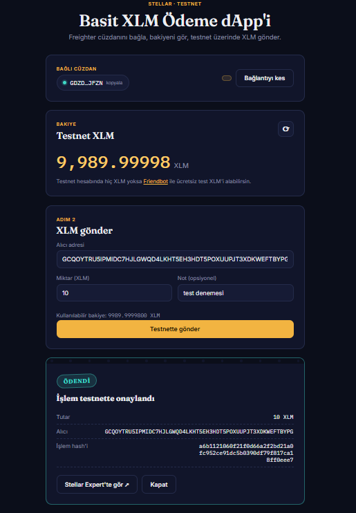

# Stellar XLM Ödeme dApp (Testnet)

Freighter cüzdanıyla bağlanıp, Stellar **Testnet** üzerinde bakiyeni görebildiğin ve
herhangi bir adrese XLM gönderebildiğin basit bir ödeme uygulaması (dApp).

Bu proje bir frontend / Web3 challenge'ın "White Belt — Level 1" gereksinimlerini
karşılamak için yapılmıştır: cüzdan bağlama/kesme, bakiye gösterme ve testnet
üzerinde gerçek bir transaction gönderip sonucunu kullanıcıya gösterme.

> ⚠️ Bu uygulama sadece **Stellar Testnet** ile çalışır. Burada kullanılan XLM
> gerçek para değildir, hiçbir finansal değeri yoktur.

## Özellikler

- 🔌 **Cüzdan bağlama / bağlantı kesme** — [Freighter](https://www.freighter.app/) tarayıcı uzantısı ile
- 💰 **Bakiye görüntüleme** — bağlı hesabın testnet XLM bakiyesi Horizon API'den çekilir
- 💸 **XLM gönderme** — alıcı adresi, miktar ve opsiyonel not (memo) ile testnet üzerinde gerçek bir ödeme transaction'ı oluşturup gönderir
- ✅ **İşlem geri bildirimi** — başarılı işlemde transaction hash'i ve Stellar Expert linki; başarısız işlemde anlaşılır bir hata mesajı
- 🛡️ **Hata yönetimi** — cüzdan kurulu değilse, yanlış ağdaysa, bakiye yetersizse veya adres hatalıysa kullanıcıya açık mesajlar gösterilir

## Kullanılan teknolojiler

- [React](https://react.dev/) + [Vite](https://vitejs.dev/)
- [`@stellar/stellar-sdk`](https://www.npmjs.com/package/@stellar/stellar-sdk) — transaction oluşturma, Horizon ile iletişim
- [`@stellar/freighter-api`](https://www.npmjs.com/package/@stellar/freighter-api) — cüzdan bağlantısı ve imzalama

## Proje yapısı

```
src/
  lib/
    stellar.js      # Horizon / SDK mantığı: bakiye okuma, tx oluşturma, tx gönderme
    freighter.js     # Freighter cüzdan mantığı: connect, network kontrolü, sign
  components/
    WalletPanel.jsx  # Bağlan / bağlantıyı kes arayüzü
    BalanceCard.jsx  # Bakiye gösterimi
    SendForm.jsx     # Gönderim formu + doğrulama
    ReceiptCard.jsx  # İşlem sonucu (başarı/başarısızlık) kartı
  App.jsx            # Tüm state ve akışı birbirine bağlayan ana bileşen
```

## Kurulum (yerelde çalıştırma)

### Ön koşullar

1. [Node.js](https://nodejs.org/) (v18 veya üstü)
2. Tarayıcına kurulu [Freighter cüzdan uzantısı](https://www.freighter.app/) (Chrome/Firefox)
3. Freighter içinde **Testnet** ağına geçilmiş olmalı (Freighter → Settings → Network → **Test Net**)
4. Freighter cüzdanında testnet XLM olması için [Friendbot](https://laboratory.stellar.org/#account-creator?network=test) üzerinden hesabını fonlaman gerekir

### Adımlar

```bash
# 1. Depoyu klonla
git clone <bu-repo-linki>
cd stellar-payment-dapp

# 2. Bağımlılıkları kur
npm install

# 3. Geliştirme sunucusunu başlat
npm run dev
```

Tarayıcıda açılan adresten (genelde `http://localhost:5173`) uygulamaya gir,
Freighter'ı bağla ve testnet XLM göndermeyi dene.

### Üretim derlemesi

```bash
npm run build
npm run preview
```

## Nasıl çalışıyor?

1. **Bağlan**: "Freighter ile bağlan" butonuna basıldığında uygulama Freighter'ın
   kurulu olup olmadığını kontrol eder, izin ister ve kullanıcının **Testnet**'te
   olduğunu doğrular. Farklı bir ağdaysa kullanıcıya net bir uyarı gösterilir.
2. **Bakiye**: Bağlanan adresin hesabı Horizon Testnet API'sinden (`loadAccount`)
   okunur ve `native` (XLM) bakiyesi ekrana basılır. Hesap testnette hiç
   fonlanmamışsa bakiye `0` olarak gösterilir.
3. **Gönderim**: Form girdileri doğrulanır (geçerli adres formatı, pozitif miktar),
   imzasız bir `payment` transaction'ı oluşturulur, Freighter ile imzalatılır ve
   Horizon'a gönderilir (`submitTransaction`).
4. **Sonuç**: İşlem başarılıysa transaction hash'i, tutar, alıcı adresi ve
   Stellar Expert testnet explorer linki gösterilir. Başarısızsa Horizon'dan
   dönen hata, kullanıcının anlayabileceği bir mesaja çevrilir (örn. "bakiye
   yetersiz").

### "Bağlantıyı kes" hakkında bir not

Freighter, tarayıcı uzantısı seviyesinde gerçek bir "disconnect" API'si sunmaz
(izin iptali kullanıcı tarafından uzantı ayarlarından yapılır). Bu yüzden
"Bağlantıyı kes" butonu **uygulamanın kendi oturumunu** temizler: adres, bakiye
ve işlem geçmişi state'ten silinir ve kullanıcı "bağlı değil" ekranına döner.

## Ekran görüntüleri

| Cüzdan bağlı durumu                                    | Bakiye gösterimi                        |
| ------------------------------------------------------ | --------------------------------------- |
|  |  |

| Başarılı testnet transaction'ı                                    | İşlem sonucu kullanıcıya gösteriliyor                    |
| ----------------------------------------------------------------- | -------------------------------------------------------- |
|  |  |

## Lisans

Bu proje eğitim/challenge amaçlı oluşturulmuştur, MIT lisansı ile özgürce kullanılabilir.
